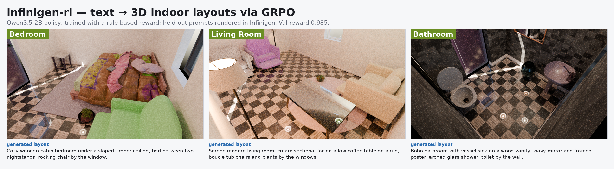

# infinigen-rl



*Held-out prompts → layouts generated by the trained Qwen3.5-2B policy → rendered in Infinigen (val reward 0.985).*

Reinforcement-learning pipeline that teaches a **Qwen3.5-2B** language model to turn a
plain-English room description into a valid **Infinigen** 3D interior-layout schema, trained
with **GRPO** (via verl) against a deterministic rule-based reward, and evaluated by rendering
the generated layouts in Infinigen/Blender.

> This repo is **self-contained for training and inference**. The GRPO trainer
> (`verl.trainer.main_ppo`) is **vendored** at `external/verl/` (pinned, unmodified — see
> `external/verl/VENDORED.md`), so the actual RL training algorithm ships with the repo.
> The **infinigen** renderer stays an external checkout (large; see `config/paths.env`), with
> its three small env-gated core edits captured in `patches/` + `docs/INFINIGEN_PATCHES.md`.
> Model weights, the venv, and the dataset are environment/artifacts (not code) and are
> referenced via `config/paths.env`, not vendored.

---

## TL;DR — the whole thing in one picture

```
                        ┌─────────────────── offline (one-time) ───────────────────┐
 reference photo  ─►  author_gt_schemas.py  ─►  GT IndoorConfig JSON (191 schemas)
                                                     │
                                      build_indoor_dataset.py
                                                     ▼
                               train/val .parquet  {prompt(system+user), ground_truth}
                        └───────────────────────────────────────────────────────────┘
                                                     │
   ┌──────────────────────────── GRPO training loop (verl, text-only) ───────────────────────┐
   │  prompt(text) ─► Qwen3.5-2B policy πθ ─(vLLM, n=8)─► 8× JSON layouts                      │
   │                                                   │                                       │
   │                        reward_indoor.compute_score(gen, GT)  ∈ [0,1]  (schema-vs-schema)  │
   │                                                   │                                       │
   │     GRPO: adv = r − group_mean · FSDP2 · + KL(πθ‖πref) ─► ∇θ update ─► back to πθ          │
   └───────────────────────────────────────────────────────────────────────────────────────┘
                                                     │ checkpoint
                        ┌──────────────── eval / inference (offline) ────────────────┐
                        │  merge FSDP→HF ─► sample_indoor_policy.py ─► JSON layouts    │
                        │  ─► render_samples.py (Infinigen solve + Blender render)     │
                        │  ─► make_sample_dashboard.py ─► TensorBoard gallery          │
                        └─────────────────────────────────────────────────────────────┘
```

**The one subtle thing people get wrong:** rendering is **not** in the training loop. The
reward is computed from JSON (`reward_indoor`), which is fast and deterministic. Infinigen is
used only to (a) define the object ontology / author GT and (b) visually validate the trained
policy. See `docs/ARCHITECTURE.md`.

---

## Repo layout

```
config/paths.env            # EDIT THIS — all absolute paths (verl, infinigen, venv, data)
src/
  indoor_config_space.py    # IndoorConfig schema + SCHEMA_FOR_LLM (the system-prompt spec)
  indoor_ontology.py        # per-room ONTOLOGY: core/optional/forbidden factories, surfaces, budgets
  reward_indoor.py          # compute_score(): the GRPO reward (schema-vs-schema, room-type dispatch)
  build_indoor_dataset.py   # GT schemas (+captions) -> train/val parquet
  author_gt_schemas.py      # author the GT IndoorConfig schemas (offline)
  sample_indoor_policy.py   # load a merged HF checkpoint, generate layouts, score them
  render_indoor.py          # render one IndoorConfig via Infinigen (coarse solve -> Blender)  [needs infinigen]
  render_samples.py         # batch-render generated layouts -> contact sheets               [needs infinigen]
  validate_gt_render.py     # render + auto-check the GT schemas (Phase-B gate)               [needs infinigen]
  render_scene.py, config_space.py  # shared render helpers / nature-scene schema
  make_sample_dashboard.py  # build the TensorBoard image+prompt gallery
launch/
  run_grpo_fsdp.sh          # the GRPO run script (all knobs env-overridable)
  train.sbatch              # durable slurm wrapper; forwards "$@" hydra overrides
  sample.sbatch             # batch-job: sample a checkpoint on 1 GPU
  render_samples.sbatch     # batch-job: render generated layouts on an 8-GPU node
  render_gt.sbatch          # batch-job: render/validate the GT schemas
  tensorboard.sh            # launch both dashboards (6007 curves, 6008 gallery)
external/verl/              # VENDORED verl trainer (pinned, unmodified). `verl.trainer.main_ppo`
                            # = the actual GRPO loop. VENDORED.md records the upstream commit.
patches/infinigen/
  rl_inject.py              # the whole RL hook (new file in infinigen) — the heart of the integration
docs/
  ARCHITECTURE.md DATA.md REWARD.md TRAINING.md INFERENCE.md INFINIGEN_PATCHES.md
```
No data ships in this repo. GT schemas + reference photos live in the external infinigen
checkout (`$SCAFFOLD`); the built train/val parquet is written to `$DATA_ROOT` (defaults to a
gitignored `data/`). See `docs/DATA.md`.

## Quickstart

```bash
cd infinigen-rl
source config/paths.env           # 1. point paths at your verl + infinigen checkouts
#   (one-time) apply the 3 infinigen core edits — see docs/INFINIGEN_PATCHES.md

# 2. build the merged 5-room dataset (166 train / 25 val)
$PY src/build_indoor_dataset.py --rooms $ROOMS --out_dir $DATA_ROOT --n_val 5

# 3. sanity-check the reward ceiling (GT-vs-GT should be ~1.0, junk -> 0)
$PY -c "import reward_indoor as R,glob;print([round(R.compute_score('x',open(p).read(),open(p).read(),{})['score'],2) for p in glob.glob('$SCAFFOLD/gt_schemas/bathroom/*.json')][:5])"

# 4. train (merged policy, 8-GPU p4 node, checkpoints every 20 steps)
cd $VERL_ROOT && sbatch --job-name=qwen35-grpo-indoor \
  --partition=p4-80-main --qos=batch --nodes=1 --gres=gpu:8 --cpus-per-task=96 --time=08:00:00 \
  --export=ALL,NDEVICES_PER_NODE=8,TRAIN_FILE=$DATA_ROOT/train.parquet,TEST_FILE=$DATA_ROOT/val.parquet,EXPERIMENT_NAME=Qwen3.5-2B-GRPO-indoor,PROJECT_NAME=GRPO-Infinigen-indoor \
  $REPO_ROOT/launch/train.sbatch trainer.save_freq=20 trainer.test_freq=20

# 5. inference: merge checkpoint -> sample -> render -> dashboard  (see docs/INFERENCE.md)
```

See `docs/TRAINING.md` and `docs/INFERENCE.md` for the full, step-by-step commands.

## Known results (reference run, 2026-10-01)
- Merged 5-room run, 60 steps: train reward **0.63 → 0.96**, held-out val **0.985**
  (parse_ok 1.0, presence/placement 1.0, zero forbidden; residual is `set_match`).
- 14/15 sampled held-out layouts rendered cleanly; the 15th was an over-constrained
  kitchen+living scene (solver `viol=1.0`). Fixed a `spacing`-objective render crash along the
  way (see `docs/INFINIGEN_PATCHES.md`).

## Provenance
`src/` files are faithful snapshots of the scaffold at
`infinigen/rl_infinigen_beginner/scripts/` and `verl/rl_infinigen_bathroom/`. The authoritative
copies currently live there; this repo bundles them for portability + documentation. Keep them
in sync if you edit upstream.
